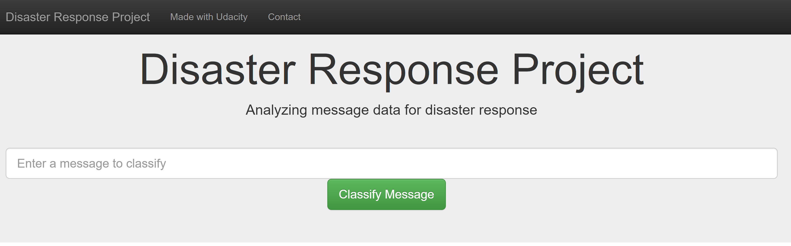

# Disaster Response Pipeline Project

## Project Description
In this project, we will build a model to classify messages that are sent during disasters. There are 36 pre-defined categories, and examples of these categories include Aid Related, Medical Help, Search And Rescue, etc. By classifying these messages, we can allow these messages to be sent to the appropriate disaster relief agency. This project will involve the building of a basic ETL and Machine Learning pipeline to facilitate the task. This is also a multi-label classification task, since a message can belong to one or more categories.

Finally, this project contains a web app where you can input a message and get classification results.

## File Description:
~~~~~~~
disaster_response_pipeline
  |-- app
        |-- templates
                |-- go.html # classification result page of web app
                |-- master.html # main page of web app
        |-- run.py # Flask file that runs app
  |-- data
        |-- disaster_message.csv  # data to process.
        |-- disaster_categories.csv # data to process.
        |-- DisasterResponse.db # database to save clean data.
        |-- process_data.py  # Processing the data input.
  |-- models
        |-- MLclassifier.pkl  # saved model
        |-- train_classifier.py

  |-- ETL Pipeline Preparation.ipynb
  |-- ML Pipeline Preparation.ipynb
  |-- README.md
~~~~~~~

  1. process_data.py: This python excutuble code takes as its input csv files containing
     message data and message categories (labels), and then creates a SQL database
  2. train_classifier.py: This code trains the ML model with the SQL data base
  3. ETL Pipeline Preparation.ipynb: process_data.py development procces
  4. ML Pipeline Preparation.ipynb: train_classifier.py. development procces
  5. data: This folder contains sample messages and categories datasets in csv format.
  6. app: cointains the run.py to iniate the web app.

### Instructions:
1. Run the following commands in the project's root directory to set up your database and model.

    - To run ETL pipeline that cleans data and stores in database
        `python data/process_data.py data/disaster_messages.csv data/disaster_categories.csv data/DisasterResponse.db`
    - To run ML pipeline that trains classifier and saves
        `python models/train_classifier.py data/DisasterResponse.db models/MLclassifier.pkl`

2. Go to `app` directory: `cd app`

3. Run your web app: `python run.py`

4. Click the `PREVIEW` button to open the homepage
